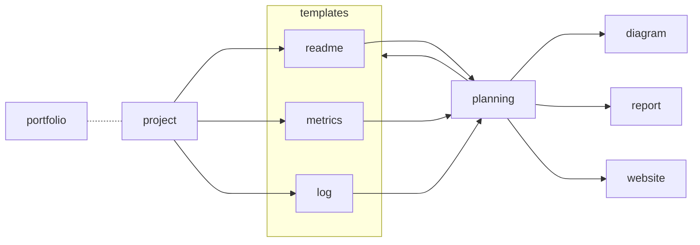

All things change, and all things in this document and its template will evolve over time. Keep records when things go unexpectedly.

## Current Intent

What's the idea? What are you currently trying to do? What are you trying to get out of the whole thing?

I want this to be the codified set of strategies I've used to attempt to organize my efforts. It should be a way for me to think about how my projects interact and what I'm trying to accomplish with them. It's also probably the closest interface to my journaling setup in meat space.

This is not a manual work. This should all be script based and as automatically updated as possible. The manual part should come from the planning choices and the evaluations, but I want this project to be a collection of scripts and methods to accomplish those goals, not exclusively some "meta theory" about how to do things (although that's part of it). This should be first and foremost a practical system of understanding and directing my efforts.

If my projects had a frontend and a backend, this would be the choke-point for the hourglass pattern.

In a lot of ways I think this should interact with the website project very closely. It's an attempt to have some sort of "overview" to what I'm doing and why.

I almost forgot! I think the most important part of this project may be its templates. Each project needs a README, and so some thought has been put into how I should design and make those from the ground up. As I develop more about how I want to approach tasks, I think these templates are a great way of *removing* the automation, and really getting bac to basics when you start something.

The templates should make you reflect. It should help you focus and direct your efforts, without boxing you in creatively. Always prune. Starting big is the right way, but less is more. Trim out **everything** except what really helps. Don't be scared to make. Don't be scared to critique. Marie Kondo yourself.

- organize
  - translate local project docs to webpage format
  - readme files
  - log entries
- evaluate
- plan
  - templates

## Inspiration

You'll be reinventing the wheel if you don't go to the market and see what other people have already done.

I like how Obsidian tries to organize things, but it's too tied to link structure and markdown documents. I want this to be something between operations research and agile development for a more general context.

- Jekyll
- Obsidian
- Agile

The distinction is that these are all just "overviews" of what you're working on. Agile is for strategy developing, but this is somewhere in-between. I want it to be like a robot maid for your project file system. My project files are growing out of control, and they often do not remain "in sync" as I attempt to have one page refer to the progress in another. If I make any progress, I have to update all pages that refer to it, it's a nightmare.

The same way Jekyll is a way of taking simple blog format markdown document and parsing it into a webpage, I want this to be a way of taking local project logs, and consolidating them in a collection of well organized, blog formatted documents.

## Method

How does it actually work? Diagram or brief overview; save details for additional docs.

For each portfolio project, any file named in ALL_CAPS is a templated file to be transferred to the planning diagram. This is things like `README.md`, `IDEAS.md`, `METRICS.md`, `LOG.md` and so on. Each is made to serve a particular purpose, and I will do my best to detail them here as I work.

## Off Ramp Goals

What is the bare minimum it takes to have a "usable" result? Without an off ramp you're investing in a new lifestyle.

First words, then lists, then diagrams. Think big and prune. Tasks are better than ideas.

- organize
  - templates
    - readme
    - ideas
  - template managers
    - collector/update
  - template update?
  - website consolidation
    - connection graph

- evaluate
- plan

- [ ] Main thing to do
  - [ ] There are always parts to it
  - [ ] More than one thing makes a list
- [ ] Make a follow up task

> Remember that *tasks* age like milk, not like wine.

Only **schedule** what is necessary. Ideas go in an "IDEAS.md" file, not the road-map. *Then* select tasks from the pool of ideas.

## Dependencies

What technologies does this assume you have installed and how would other people find and install it?

## Layout

I just opened this folder; What is all of it? How are things laid out?

## References

If you need a thing go [to the source](src)!

[src]: www.alwayslistyoursources.com
