## Project Connections

```mermaid
graph LR

website{{"Website\n 😄 🍞 🐁 🚀"}}
resume(["Resume\n 🫤 🍞 🐁 🎄"])
imagetournament["Image Tournament\n 😄 🍞 🐁 🚀"]
spelllooker["Spell Looker\n 🫤 🍞 🐉 ✈️"]

subgraph games["Games"]
  jackofalltrades{{"Jack of All Trades\n 😄 🍞 🐁 🚀"}}
  spacewhales{{"SpaceWhales!\n 😄 🍞 🐉 ✈️"}}
end

subgraph cellularstates["Cellular State Machines"]
  farmersoldier{{"Farmer/Soldier\n 😄 🍞 🐁 🚀"}}
  inclusionsfront["Inclusions Frontend\n 🫤 🍞 🐉 ✈️"]
end
inclusionsback(["Inclusions Backend\n 🫤 🍞 🐉 🎄"])

website---resume
website---games
website---cellularstates
website-.-imagetournament
spelllooker-.-imagetournament

inclusionsfront-.-inclusionsback

graphchat{{"GraphChat\n 😄 🍞 🐉 ✈️"}}
monotextdisplay{{"Monotext Display\n 😄 🍞 🐁 ✈️"}}
spellbook{{"Spellbook\n 😄 🍞 🐁 ✈️"}}
roleplay{{"Roleplay\n 😄 🍞 🐉 🚌"}}
planning(["Planning\n 😄 🍞 🐁 📆"])

graphchat---monotextdisplay
graphchat---spellbook
graphchat---roleplay
graphchat---planning

roleplay---planning

monotextdisplay---spellbook

planning---spellbook

handwriting{{"Handwriting\n 🫤 🍞 🐉 ✈️"}}
pnggcode{{"PNG to GCode\n 🫤 🥩 🐁 🚀"}}

handwriting---pnggcode

trains{{"TTrack Trains\n 😄 💍 🐁 ✈️"}}
treeclimber["Tree Climber\n 😄 💍 🐉 ✈️"]
trees{{"Model Trees\n 😄 🥩 🐉 ✈️"}}

trains---trees
treeclimber-.-trees
```

## Usable

- Resume - professional achievements formatted for printing
- Planning - the process of coming up with and organizing plans
- Inclusions Backend - diffusion, advection, reaction system with statistical inclusions

## Under Construction

- Farmer/Soldier - predator/prey simulation
- GraphChat - chat/forum/directory/dependency diagram navigator
- Handwriting - personalized OCR
- Jack of All Trades - **good**, 2 player, euchre-like, trick-taking game
- Monotext Display - ASCII art display/editor in the style of vim
- NMath - library of the maths I find useful or interesting
- PNG to GCode - convert rasterized images into paths for plotting
- Roleplay - spotify for the mind with roleplay as the medium
- SpaceWhales! - 2d kerbal space program without the construction
- Spellbook - dresden's skull as a chatbot, armed with my knowledge
- Trees - artificial tree generator for 3d printing miniatures
- Website - my publicly facing website to have fun and show off
- TTrack Trains - server-style rack of ttrack modules that form a loop for the tree

## Potentials

- Image Tournament - gamify prioritization from a folder of pictures
- Spell Looker - track your style for AI image generation
- Table - living/dining room low table
- Tree Climber - camera eyes on a "circular tree centipede"
- Digestion Timer - stopwatch to measure processing times
- Tie Dye - making a tie dying workflow for the apartment
- Pit Reload - funnel/reload mechanism for a standard mason jar cherry pitter
- Resources - generalizing the "nutrient" problem: needs vs resources
- Inclusions Frontend - manipulator for inclusions simulation
- Absurdist Kettle - stove-top demonstration industrial boiler
- Everybody Wins - you can only move others, but win or lose yourself
- Spool - 3d lidar projector/scanner that spins like wrapping a spool or bobbin
