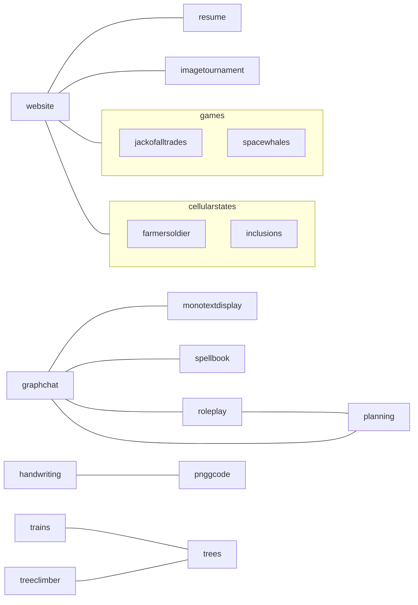

## Projects

- farmer/soldier - predator/prey simulation
- graph-chat - chat/forum/directory/dependency diagram navigator
- handwriting - personalized OCR
- inclusions - cellular diffusion, advection, reaction system with statistically generated inclusions
- jack of all trades - **good**, 2 player, euchre-like, trick-taking game
- monotext display - ASCII art display/editor in the style of vim
- nmath - library of the maths I find useful or interesting
- planning - the process of coming up with and organizing plans
- png-gcode - convert rasterized images into paths for plotting
- resume - professional achievements formatted for printing
- roleplay - spotify for the mind with roleplay as the medium
- spacewhales - 2d kerbal space program without the construction
- spellbook - dresden's skull as a chatbot, armed with my knowledge
- trees - artificial tree generator for 3d printing miniatures
- website

## Ideas

- absurdist kettle - stove-top demonstration industrial boiler
- everybody wins - you can only move others, but win or lose yourself
- image tournament - gamify prioritization from a folder of pictures
- trains - server-style rack of ttrack modules that form a loop for the tree
- resources - generalizing the "nutrient" problem: needs vs resources
- spool - 3d lidar projector/scanner that spins in the path of wrapping a spool or bobbin
- tree climber - camera eyes on a "circular tree centipede"

## Connections

## Metrics

- Excitement
  1. 😄 smile = passionate
  2. 🫤 face_with_diagonal_mouth = meh
  3. 😓 sweat = chore
- Complexity
  1. 🏖️ beach_umbrella = simple
  2. 🐉 dragon = challenging
  3. ⚠️ warning = extreme
- Cost
  1. 🥩 profitable
  2. 🍞 cheap
  3. 🍷 expensive
- Duration
  1. 📆 weeks
  2. 🌙 months
  3. 🪴 years
- Progress
  1. 🚗 car = has working deliverable
  2. ⚙️ gear = making progress
  3. 💡 bulb = new idea
