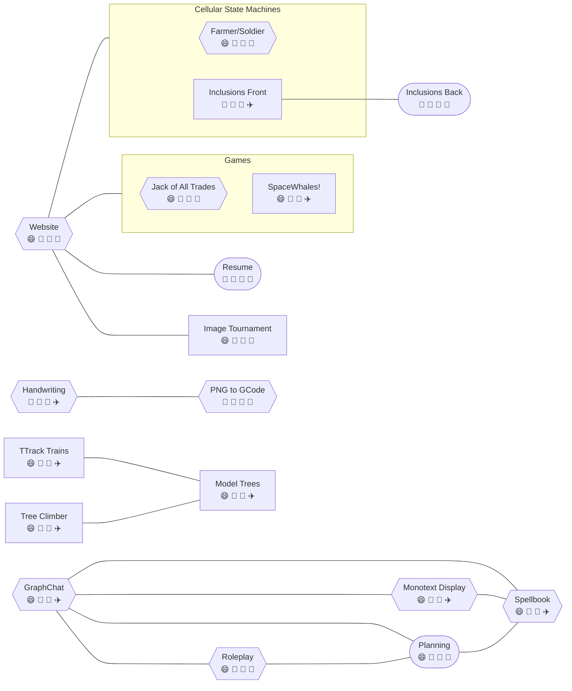

## Projects

- farmer/soldier - predator/prey simulation
- graph-chat - chat/forum/directory/dependency diagram navigator
- handwriting - personalized OCR
- inclusions - cellular diffusion, advection, reaction system with statistically generated inclusions
- jack of all trades - **good**, 2 player, euchre-like, trick-taking game
- monotext display - ASCII art display/editor in the style of vim
- nmath - library of the maths I find useful or interesting
- planning - the process of coming up with and organizing plans
- png-gcode - convert rasterized images into paths for plotting
- resume - professional achievements formatted for printing
- roleplay - spotify for the mind with roleplay as the medium
- spacewhales - 2d kerbal space program without the construction
- spellbook - dresden's skull as a chatbot, armed with my knowledge
- trees - artificial tree generator for 3d printing miniatures
- website

## Ideas

- absurdist kettle - stove-top demonstration industrial boiler
- everybody wins - you can only move others, but win or lose yourself
- image tournament - gamify prioritization from a folder of pictures
- trains - server-style rack of ttrack modules that form a loop for the tree
- resources - generalizing the "nutrient" problem: needs vs resources
- spool - 3d lidar projector/scanner that spins in the path of wrapping a spool or bobbin
- tree climber - camera eyes on a "circular tree centipede"

## Connections

## Metrics

| Metric \\ Cost  |  1  |  2  |  3  |
|:---             |:---:|:---:|:---:|
| Excitement      |  😄  |  🫤  |  😓  |
| Cost            |  🥩  |  🍞  |  💍  |
| Complexity      |  🐁  |  🐉  |  ☠️  |
| Duration        |  🚀  |  ✈️  |  🚌  |
| Maintenance     |  🎄  |  📆  |  ⏰  |

- Excitement
  1. 😄 smile = passionate
  2. 🫤 face_with_diagonal_mouth = meh
  3. 😓 sweat = chore
- Cost
  1. 🥩 cut_of_meat = profitable
  2. 🍞 bread = cheap
  3. 💍 ring = expensive
- Complexity
  1. 🐁 mouse2 = easy
  2. 🐉 dragon = challenging
  3. ☠️ skull_and_crossbones = extreme
- Duration
  1. 🚀 rocket = less than weeks up front
  2. ✈️ airplane = months up front
  3. 🚌 bus = years up front
- Progress
  1. ([rounded box]) = working deliverable
  2. {{angled box}} = making progress
  3. [square box] = new idea
- Maintenance
  1. 🎄 christmas_tree = up to yearly maintenance
  2. 📆 calendar = monthly maintenance
  3. ⏰ alarm_clock = more than weekly maintenance
