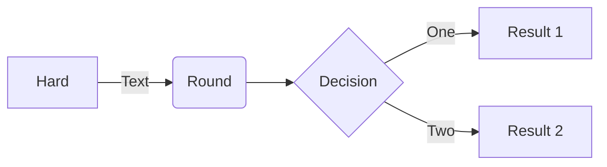

## Summary

What's the point? What are you trying to achieve?

## Influences

- A
- B

## Distinctions

- X
- Y

## Goals

Start with big concepts and break them down into progressively smaller bits until you have things that seem manageable. This is an evolving list. It will change based on obstacles and requirements, and will grow and shrink as tasks are completed, added, and learning makes bigger tasks easier.

- [ ] Main thing to do
  - [ ] There are always parts to it
  - [ ] More than one thing makes a list
- [ ] Make a follow up task

## Constraints

For each [goal](#goals) there is probably a [constraint](#constraints) or two on it. Make another list of these so you know what you have to work with

- Main thing to be aware of
  - There are always pieces to it
  - More than one thing makes a list
- Resource and time constraints are always good

## Method

[How does it work?](#goals) [What depends on what?](#constraints) What gets done in what order? Change this as necessary.

## Metrics

How do you know if you're accomplishing your [goals](#goals)? What [tests](#testing) will you use and how will you [grade](#records) them? Remember that grades are tied to [self-value](#goals), and should generally be mastery focused only (pass/fail, show you can **actually** do it in *some* setting). Avoid making prototyping a bad thing by down-grading it.

## Testing

How do we run tests? How do we interpret failures and file an item?

1. Run the main test file
2. Test names reflect what failed and why
3. More details available in a log somewhere

## Records

A table of the current "health" state of the project's components at different times.

|Date         |Metric 1 | Metric 2  |
|-            |-        |-          |
|2023-07-08   |Purple   |85%        |
|2023-07-15   |Blue     |85%        |
|-            |-        |-          |

Make a new table for different components, large metric changes, etc. At least some of the metrics should be related to the outcomes of suites of unit tests.

|Date         |Metric A | Metric B  |
|-            |-        |-          |
|2023-07-08   |Fish     |175        |
|2023-07-15   |Steak    |-24        |
|-            |-        |-          |
