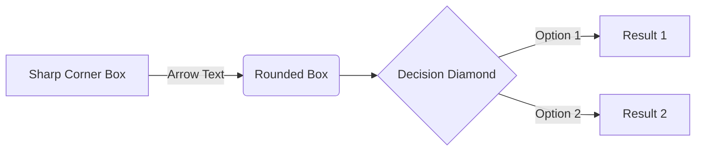

## Current Intent

What's the idea? What are you currently trying to do?

What are you trying to get out of the whole thing?

What do you think it will take at the most general levels?

### Record of Past Intents

All things change, and all things in this document and its template will evolve over time.

## Influences

You'll be reinventing the wheel if you don't go to the market and see what other people have already done.

- A
- B

## Current Understandings

What do you think you know? What have you learned as you've been working? Current mental model doesn't have to be perfect, but it should be there. Refine rather than re-build.

## Questions

What do we want to figure out? What do we need to learn to continue working?

## Goals

Start with [big concepts](#summary) and [break them down](#influences) into [progressively smaller bits](#distinctions) until you have [things that seem manageable](#goals).

This is an evolving list. It will change based on obstacles and requirements that arise, and will grow and shrink as tasks are completed, added, and learning makes bigger tasks easier.

- [ ] Main thing to do
  - [ ] There are always parts to it
  - [ ] More than one thing makes a list
- [ ] Make a follow up task

> Tasks age like milk, not like wine. Only plan what is necessary. "Pie in the sky" ideas go in separate documents.

### Constraints?

## Method

[How does it work?](#goals) [What depends on what?](#constraints) What gets done in what order? Change this as necessary.

## Testing

How do we run [tests](#testing)? How do we interpret failures and file an item? Where do we track bugs?

1. Where is the main test file?
2. Test names reflect what failed and why
3. More details available in a [log somewhere](#records)

### Records

A table of the "health records" of the project's components

|Date         |Metric 1 | Metric 2  |
|-            |-        |-          |
|2023-07-08   |Purple   |85%        |
|2023-07-15   |Blue     |85%        |
|-            |-        |-          |
