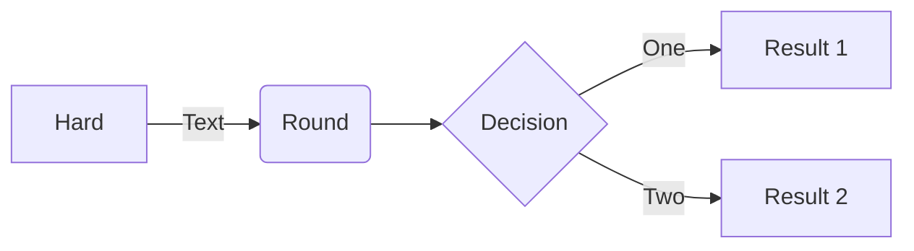

## Summary

[What's the point? What are you trying to achieve?]

## Influences

- A
- B

## Distinctions

- X
- Y

## Goals

Start with big concepts and break them down into progressively smaller bits until you have things that seem manageable. This is an evolving list. It will change based on obstacles and requirements, and will grow and shrink as tasks are completed, added, and learning makes bigger tasks easier.

- [ ] Main thing to do
  - [ ] There are always parts to it
  - [ ] More than one thing makes a list
- [ ] Make a follow up task

## Method

[How does it work? What depends on what? What gets done in what order? Change this as necessary.]

## Metrics

[How do you know if you're accomplishing your goals?]

## Testing

[How do we run tests? How do we interpret failures and file an item?]

## Records

[A table of the current state of projects at different timestamps]

|Date         |Metric 1 | Metric 2  |
|-            |-        |-          |
|2023-07-08   |Purple   |85%        |
|2023-07-15   |Blue     |85%        |
|-            |-        |-          |

[Make a new table every time your metrics change.]

|Date         |Metric A | Metric B  |
|-            |-        |-          |
|2023-07-08   |Fish     |175        |
|2023-07-15   |Steak    |-24        |
|-            |-        |-          |
