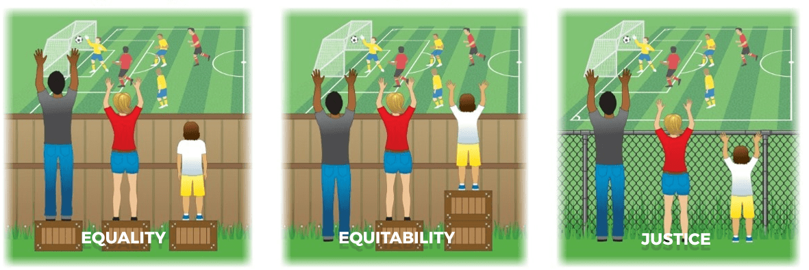

# Planning

Planning is ultimately a task in resource management where your most valuable resource is often time/work-hours.

First, know what you have. Then know what you want, and what the acting agents, often families in organizations, around you have and want.

Break desires down into their component parts, based on resource needs if possible. What does it take to get that? There is a chain of events that leads up to and continues after every event. A desire does not exist in isolation.

Figure out the possible paths from where you are now to where you want to be, and take notes. You need a method by which to find the "best" route. This cannot be a plan. Plans expect certainty, and real goals change quite often. Instead what you need is an adaptable and robust collection of [strategies](https://youtu.be/iuYlGRnC7J8).

Reflect thoughtfully and often. Grow. Distill.

## Steps

Everything is about transitions. Going from one frame of mind to another. Creating is about starting loose. Let go of all that holds you back, and hone in on what you would really want if there were no strings attached. Then we slowly add the strings back in and adjust. This is one of my current strategies.

Start by brainstorming, and then slowly put those ideas into more and more organized forms, removing the chaff as you go.

The next thing to think about will be metrics. You don't know anything about where you're going if you don't know where you are.

But first thing's first:

1. Landing Bin
2. Indented List
3. Diagram

### Start Small

When forming ideas, it's best to start by just pulling things out of the ether at first. Brainstorm into a landing bin. Do some free-writing and get a bag of words on a page. Think related influences, but also think about examples of what not to do.

It's easy to critique yourself at this stage and slow yourself down, but don't. Let loose and wait until you have a huge dataset of options before starting to decide which ones you like best. Try not to filter as you go: choose afterwards.

Slowly start to focus on your feelings *about* the stuff you're getting out of the brainstorm. Feel free to keep adding to it as you start to develop preferences, but start thinking about the ones that actually seem to reflect the issue at hand.

Spend less and less on brainstorming, and start moving towards picking the items you think frame the issue well. Do the Marie Kondo "spark joy" process (and the equivalent "spark derision" for the negative examples). Cherry-pick the influences, distinctions, and aversions you want as a draft concept to frame the plan. Once you're satisfied with the results, and are doing nothing but organizing and sorting the results, move on from the bag of words.

### Organizing

Once you're organizing, it's time to start thinking resources. We are looking for what constraints we have in our setup, because that helps determine how we can achieve our goals.

Priorities are about preferences vs costs, but desire and value are only measurable in the context of an exchange. There is no natural currency here, only bartering. You must take into account that things do not exist in isolation. How you value things is most assuredly not the same as others do. Find out how you differ in your evaluations with those around you who have a stake in the outcome.

In this order, ask everyone involved:

1. What do you "need" and how much do you "need" it?
  a. What are you willing to give on, and by how much?
  b. What aversions and hard lines are there?
2. What do you have to offer towards fulfilling others needs? (credit vs debt)
3. What do we have collectively? (inventory)
4. What desires do we go without, based on their cost, or our available resources?
5. Based on the needs we desire to achieve, what resources will we use and how will we achieve them? What metrics will we use to track our progress?

I have yet to really put this practice into action, but I love the idea of a ranking system for needs, where:

- 0 means "this need can't or won't be satisfied", eg. I want to make a freshly cooked meal seven days a week
- 1 means "will go along with this need, even though I don't want to", eg. Python is the most ubiquitous language, therefore I will go along with it
- 2 means "actively want this need to be satisfied", eg. I want to work on a Linux, I want to work on a desktop computer (I'm on a windows desktop, so only got 1 out of 2)
- 3 means "this need must be satisfied, no questions", eg. I *will* have coffee in the morning

This requires the needs to be atomic in nature. Break needs down as far as necessary to make interacting with your resources straightforward. Needs often compete with each other, and that is ok. That's why we diagram the interdependencies next.

You may want to know things like, "Is your need to work with a piece of software more pressing than your need to use Linux?". As you find these comparisons coming up, do not evaluate them just yet. Write them down.

Constraints and dependencies are what come out of this organizing process. Those questions tell you what desires are competing with each other. Like the map of where the walls are in a maze.

You also want to keep an eye out for moments where you say to yourself things like, "I think I've already done this!", or "This would work great as a ___ for this other thing!". Things don't just compete, they also reinforce each other. Track that as well.

If you can find projects that are all really doing the same thing, or accomplishing similar goals, you can combine efforts by sharing the bits that are necessary for each. Similarly, avoiding similar challenges is a great way to make friends.

Once you find you have an inventory of what everyone has, wants, wants to avoid, and how much they want or don't want things, you have a sort of "menu" or "auction list", or a sort of "most wanted list" I guess.

This is a multi-column table of values for what you and the others around you are trying to achieve or avoid. Positive means desired, negative means averse. After taking a tally, each person's score for the inventory of desires goes in their row. I expect this to be a mostly sparse table, as no-one really cares much about the desires of others unless they work together closely.

With this you are ready to build a dependency graph for your goals in a broader context.

### Dependencies

We have a menu. What do we buy? What do we want to eat, and in what order? We have a list of what people want to "eat for the week", but we need to meal plan and we need to make a grocery list. Who's vegetarian? Do we have anyone that needs to keep Halal, Kosher, or gluten free? Majority rule, minority rights. No one should be excluded, but the exception should not make the rule.

That's how I used to think about it I suppose. I do like the idea that "when you design for the least you design for the most" though.

It all reminds me of the [memes I see on equitability](https://roundmap.com/equitability/).

If you think of sidewalks, you don't *really* need them. You could walk on the road. But not everyon *can* walk on the road, and you're forced to re-phrase it as "*you* don't really need them".

But in the end *everyone* benefits from the accessibility that is often needed in certain cases. Who wouldn't want a giant sidewalk to make up for the giant streets? Sure, there aren't "people companies" lobbying for them, but they sure make kids, dogs, elderly, bus stops, and so on, much easier. They make me feel better about the place I live, and that *I'm* not going to get hit, whether I can step over the holes in the road or not.

## Sequential Habits

Each person, and each thing, is often bound by the same problems as a single core processor: you can only do one thing at a time. You have strengths and weaknesses, and you must delegate and decide what to spend more or less time on. This is not a direct interaction, you must translate these things to the more practical questions of "for how long?", and "how often?" for each task. Or maybe more directly: "when to pause what you're doing" and "what to switch to", in an abstract level of hierarchies.

This is not an easy task, and brings to mind a server system of producer/consumers.
